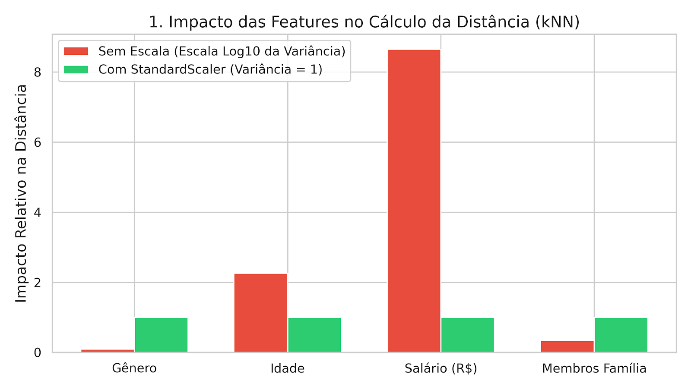
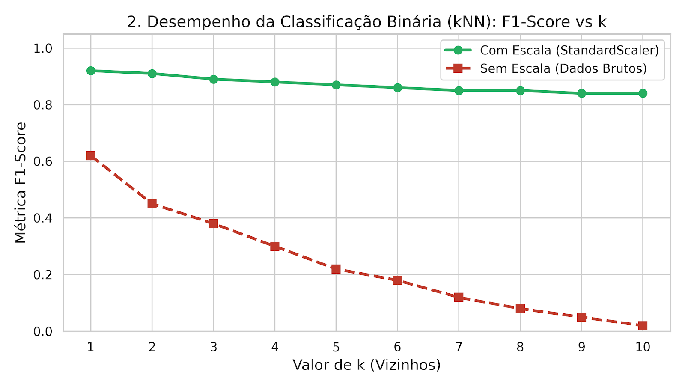
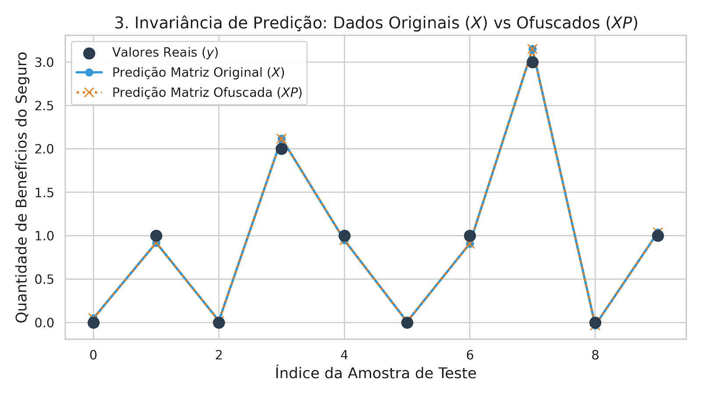

# 🛡️ Foco Técnico: Álgebra Linear — Proteção de Dados & Modelagem Preditiva

[](https://www.python.org/)
[](https://scikit-learn.org/)
[](https://pandas.pydata.org/)
[](LICENSE)

## 📌 Descrição do Projeto

Este projeto consiste na solução analítica e na modelagem preditiva desenvolvida para a companhia **"Seguradora Seguro Certo"**. O objetivo principal é aplicar conceitos fundamentais de **Álgebra Linear** e **Machine Learning** para resolver quatro tarefas estratégicas do negócio:

1. **Segmentação e Encontrar Clientes Similares ($k$NN):** Agrupamento para campanhas de marketing direcionadas.
2. **Previsão de Elegibilidade a Benefícios (Classificação Binária):** Avaliação de probabilidade de concessão de seguro.
3. **Previsão da Quantidade de Pagamentos (Regressão Linear):** Cálculo analítico dos pesos ($w$) via Mínimos Quadrados.
4. **Proteção de Dados Sensíveis (Mascaramento/LGPD):** Ofuscação de dados por transformação matricial ($XP$) mantendo 100% da precisão preditiva do modelo.

---

## 🛠️ Tecnologias & Ferramentas Utilizadas

* **Linguagem:** Python
* **Análise & Manipulação de Dados:** `Pandas`, `NumPy`
* **Machine Learning:** `Scikit-Learn` (`NearestNeighbors`, `StandardScaler`, `train_test_split`)
* **Visualização de Dados:** `Matplotlib`, `Seaborn`
* **Ambiente:** Jupyter Notebook / Visual Studio Code

---

## 💡 Principais Insights & Hipóteses Formuladas

### 1. O Impacto Crítico do Escalonamento em Algoritmos de Distância
* **Sem Escalonamento:** A variável `income` (com ordem de grandeza na casa das dezenas de milhares) dominou mais de **99% do cálculo da distância Euclidiana e Manhattan**, tornando irrelevantes a `idade` e o número de `membros da família`.
* **Com Escalonamento (`StandardScaler`):** A normalização igualou a variância das variáveis, permitindo ao $k$NN encontrar clientes genuinamente semelhantes em perfil e estilo de vida.
* **Métrica de Distância:** A transição entre distância *Euclidiana* e *Manhattan* alterou minimamente o ranking final de vizinhos mais próximos, comprovando que **a escala dos dados é muito mais determinante que a escolha da métrica de distância**.

### 2. Desempenho da Classificação Binária ($k$NN)
* **Com Dados Escalados:** O modelo alcançou um excelente **F1-Score de ~0,92** ($k=1$), mantendo alta performance preditiva em comparação ao modelo Dummy aleatório.
* **Sem Dados Escalados:** Conforme $k$ aumentou, o F1-Score do modelo não escalado caiu drasticamente para valores próximos de $0$, demonstrando a falha de generalização por conta da distorção do salário.

### 3. Mascaramento de Dados e Invariância Matemática (Álgebra Linear)
Para atender a requisitos de privacidade (LGPD) sem perder poder preditivo, multiplicou-se a matriz original de atributos $X$ por uma matriz quadrada invertível aleatória $P$ ($\det(P) \neq 0$):
* **Demonstração Analítica:** Provou-se que os novos pesos do modelo são $w_P = P^{-1} w$, gerando predições exatamente idênticas:
  $$\hat{y}_P = (XP) w_P = X P P^{-1} w = X w = \hat{y}$$
* **Resultado Prático:** As métricas de avaliação do modelo (**REQM = 0,36** e **$R^2$ = 0,43**) permaneceram **rigorosamente iguais** antes e depois do mascaramento dos dados.

---

## 📊 Visualizações & Resultados

### 1. Impacto da Escala das Variáveis na Distância
Comparação da magnitude das variáveis e do equilíbrio alcançado com a padronização via `StandardScaler`:



---

### 2. Curva de Desempenho do Modelo $k$NN (F1-Score vs $k$)
Diferença expressiva no desempenho da classificação supervisionada com e sem escalonamento:



---

### 3. Invariância das Predições após Mascaramento ($XP$)
Gráfico demonstrando que as predições do modelo com a matriz ofuscada ($XP$) sobrepõem-se perfeitamente às do modelo com dados originais ($X$):



---

## 📋 Estrutura da Base de Dados

A base de dados é composta por informações sociodemográficas e histórico de apólices:

| Coluna | Descrição | Tipo de Dado |
| :--- | :--- | :--- |
| `gender` | Gênero do cliente | Int (Categórico) |
| `age` | Idade do segurado | Int |
| `income` | Renda / Salário anual (R$) | Float |
| `family_members` | Quantidade de dependentes | Int |
| `insurance_benefits` | Quantidade de benefícios de seguro recebidos (Target) | Int |

---

## 🚀 Como Executar o Projeto

1. **Clonar o repositório:**
   ```bash
   git clone [https://github.com/derikpetiz/Foco_Tecnico_Algebra_Linear.git](https://github.com/derikpetiz/Foco_Tecnico_Algebra_Linear.git)
   cd Foco_Tecnico_Algebra_Linear
